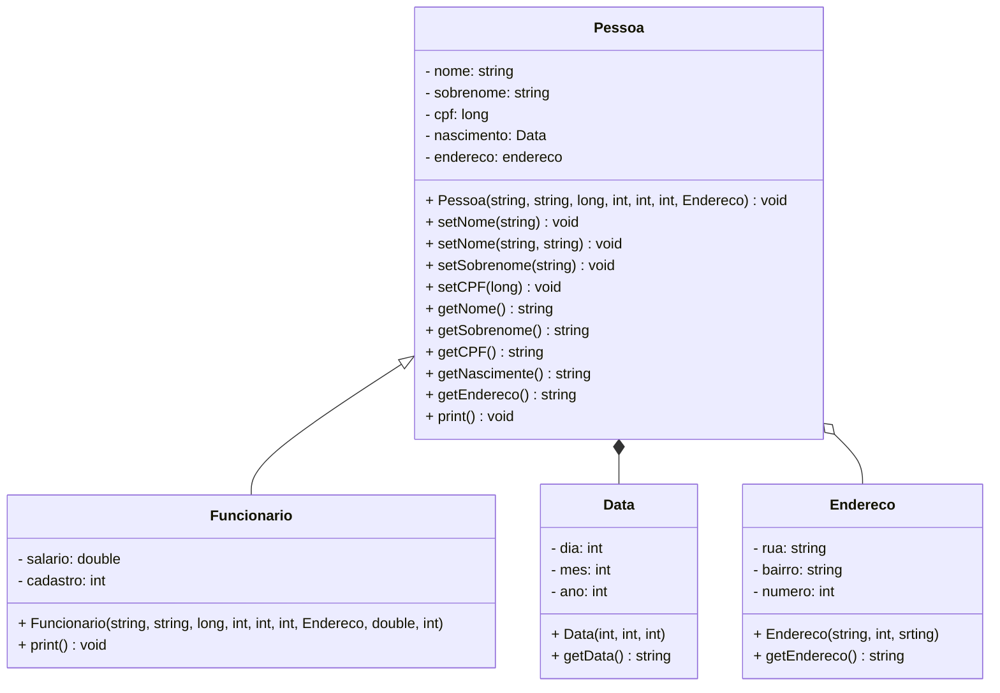

# CCP140 - Programação Orientada a Objetos

```mermaid
classDiagram
class Pessoa{
    - nome: string
    - sobrenome: string
    - cpf: long
    - nascimento: Data
    - endereco: endereco
    + Pessoa(string, string, long, int, int, int, Endereco) void
    + setNome(string) void
    + setNome(string, string) void
    + setSobrenome(string) void
    + setCPF(long) void
    + getNome() string
    + getSobrenome() string
    + getCPF() string
    + getNascimente() string
    + getEndereco() string
    + print() void
}
class Data{
    - dia: int
    - mes: int
    - ano: int
    + Data(int, int, int)
    + getData() string
}
class Endereco{
    - rua: string
    - bairro: string
    - numero: int
    + Endereco(string, int, srting)
    + getEndereco() string
}
class Funcionario{
    - salario: double
    - cadastro: int
    + Funcionario(string, string, long, int, int, int, Endereco, double, int)
    + print() void
}
Pessoa <|-- Funcionario
Pessoa *-- Data
Pessoa o-- Endereco
```
